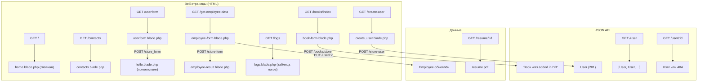

# Laravel CRM – управление сотрудниками, книгами, пользователями и логирование запросов

Веб-приложение на Laravel 11 для учёта сотрудников, ведения каталога книг, управления пользователями, генерации PDF-резюме и логирования HTTP-запросов. Реализован полный цикл CRUD-операций, серверная валидация, работа с JSON-данными и собственный middleware для перехвата запросов.

## Возможности

**Сотрудники** — создание через веб-форму с обработкой вложенного JSON (адрес и гео-координаты), сохранение в БД с разбором полей, отображение результата, обновление записей через JSON API (`PUT`). При сохранении пишется отладочный лог через `Log::debug()`.

**Каталог книг** — добавление с проверкой уникальности названия, ограничением длины полей и выбором жанра из выпадающего списка. Ошибки валидации возвращаются в форму.

**Пользователи** — создание через HTML-форму, просмотр полного списка (JSON) и получение конкретного пользователя по ID. При отсутствии записи возвращается 404.

**PDF-резюме** — динамическая генерация документа по ID пользователя через `barryvdh/laravel-dompdf`. Шаблон рендерится из Blade, результат отдаётся как поток. Для кириллицы используется шрифт DejaVu Sans.

**Логирование HTTP-запросов** — глобальный middleware `DataLogger` после каждого ответа записывает время, длительность, IP, URL, метод и параметры запроса в базу данных или в лог-файл (настраивается через `.env`). Страница `/logs` отображает все записи в виде таблицы с сортировкой по времени.

**Интерфейс** — главная страница с условным рендерингом (Blade-директивы `@if`), страница контактов, навигация через общий layout с header и footer. Подключён Bootstrap 4 через CDN.

## Стек

PHP 8.2, Laravel 11, SQLite, Blade, Bootstrap 4, barryvdh/laravel-dompdf, Vite.

## Архитектура и маршруты

Приложение построено по MVC-архитектуре Laravel. Модели используют Eloquent ORM, контроллеры наследуются от абстрактного `Controller`, представления расширяют общий layout `layouts/default`. Глобальный middleware `DataLogger` перехватывает все запросы через `terminate()` и пишет логи после отправки ответа.



## База данных

По умолчанию используется SQLite (файл `database/database.sqlite`). Схема включает четыре таблицы:

| Таблица | Назначение | Основные поля |
| --- | --- | --- |
| `users` | пользователи | `name`, `surname`, `email` (уникальный) |
| `employees` | сотрудники | `first_name`, `last_name`, `email`, `position`, `address`, `work_data`, `street`, `city`, `latitude`, `longitude` |
| `books` | каталог книг | `title` (уникальный), `author`, `genre` |
| `logs` | HTTP-логи | `time`, `duration`, `ip`, `url`, `method`, `input` |

Миграции в `database/migrations` демонстрируют как создание таблиц с нуля, так и инкрементальное изменение схемы (таблица `employees` создаётся в одной миграции, а JSON-поля добавляются в следующей).

## Переменные окружения

Файл `.env` исключён из Git. Пример — в `.env.example`.

| Переменная | Назначение | По умолчанию |
| --- | --- | --- |
| `APP_NAME` | название приложения | `Laravel` |
| `APP_ENV` | окружение | `local` |
| `APP_KEY` | ключ шифрования | — |
| `DB_CONNECTION` | тип БД | `sqlite` |
| `DB_DATABASE` | путь к файлу SQLite | `database/database.sqlite` |
| `API_DATALOGGER` | вкл/выкл логирование запросов | `true` |
| `API_DATALOGGER_USE_DB` | писать логи в БД (`true`) или в файл (`false`) | `true` |

## Запуск

Требования: PHP 8.2+, Composer.

```bash
cd ProjectLaravel
cp .env.example .env
composer update
php artisan key:generate
php artisan migrate:fresh --seed
php artisan serve
```

Приложение будет доступно по адресу `http://localhost:8000`.

## Запуск тестов

```bash
cd ProjectLaravel
php artisan test
```

## Структура репозитория

Команда для просмотра дерева:

```bash
tree -L 3
```

Основные пути:

```bash
app/Http/Controllers/EmployeeController.php # CRUD сотрудников и логирование
app/Http/Controllers/BookController.php # каталог книг с валидацией
app/Http/Controllers/UserController.php # CRUD пользователей (JSON API)
app/Http/Controllers/LogController.php # просмотр логов HTTP-запросов
app/Http/Controllers/FormProcessor.php # обработка простой формы
app/Http/Controllers/PdfGeneratorController.php # генерация PDF-резюме
app/Http/Middleware/DataLogger.php # глобальное логирование запросов
app/Models # модели Eloquent (User, Employee, Book, Log)
routes/web.php # 12 маршрутов (HTML, JSON, PDF)
resources/views/layouts # общий layout (header, footer, Bootstrap 4)
resources/views # страницы и формы
database/migrations # 8 миграций
```